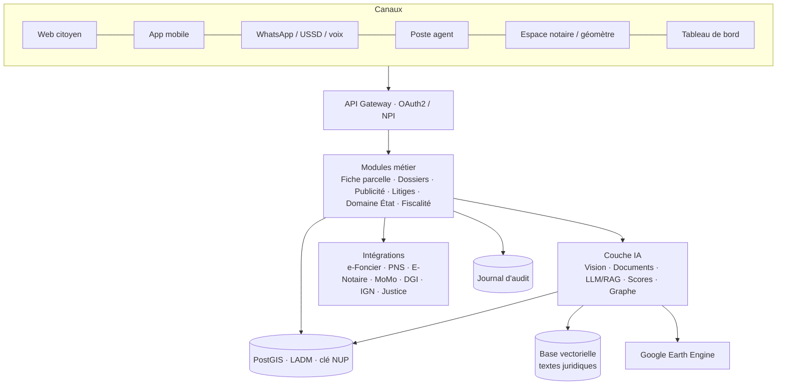

# PRD — Foncier Intelligent (Bénin)

> **Version** 1.0 · septembre 2026 · **Auteur** UDI-AFRICA (1er prix, Hackathon IA « Foncier Intelligent », ASIN · ANDF · LuxDev, 24–26 sept. 2025)
> **Statut** Brouillon pour discussion avec l'ANDF et l'ASIN · **Version visuelle** `PRD.html`
> Le nom « Foncier Intelligent » est un nom de travail.

---

## 0. Résumé

Le Bénin a posé les bases légales (Code foncier et domanial 2013, amendé en 2017) et numériques (e-Foncier obligatoire dans 12 communes depuis le 1er janvier 2025, Numéro Unique Parcellaire par le décret 2025-176, e-services sur le PNS avec le NPI, E-Notaire, paiement MoMo/Visa). Il manque encore la capacité à **vérifier** une parcelle avant l'achat, à **surveiller** le terrain dans la durée et à **accélérer** l'instruction des dossiers.

**Foncier Intelligent** est une couche d'intelligence artificielle posée sur ces briques existantes. Elle **ne remplace pas** le registre de l'ANDF, qui reste la source de vérité. Elle le lit, l'enrichit (imagerie satellite, analyse de documents, scores) et renvoie aux usagers et aux agents des fiches parcelles, des alertes et des dossiers pré-vérifiés.

**Trois promesses :**
1. **Citoyen / acheteur** : vérifier une parcelle en 30 secondes depuis un téléphone (statut, image du terrain, risque, valeur estimée).
2. **Agent ANDF / BCDF** : un copilote qui lit les dossiers, repère les anomalies et prépare les actes. Objectif : passer de 120 à 60 jours pour un titre foncier.
3. **État** : des alertes d'empiètement, un cadastre plus fiable, une assiette fiscale plus juste, un outil contre la fraude et le blanchiment.

---

## 1. Contexte

### 1.1 Cadre légal et institutionnel

| Texte / organe | Contenu utile au produit |
|---|---|
| Loi 2013-01 (Code foncier et domanial, CFD), amendée par la loi 2017-15 | Titre foncier (TF) comme acte unique de propriété, cadastre, reconnaissance des droits coutumiers, création de l'ANDF |
| Décret 2015-010 | Missions de l'ANDF, dont : gérer le cadastre, confirmer les droits, délivrer le TF, **mettre en place un système national d'information foncière transparent, accessible, fiable et à jour**, protéger les archives |
| Décret 2015-017 | Composition des CoGeF (commune) et SVGF (village) |
| Art. 17, 18, 516 CFD | Depuis la fin de la période transitoire, transaction par acte notarié ou acte sous seing privé déposé chez le notaire |
| Art. 361 CFD | Approbation d'un projet de mise en valeur pour les terres rurales > 20 ha |
| Préemption ANDF | Sur toute transaction de terre rurale ≥ 2 ha ; visa de l'ANDF sur toute vente rurale ; avis au Conseil des ministres au-delà de 500 ha |
| Décision ANDF du 27 déc. 2024 | Preuve de l'origine des fonds obligatoire pour les terres rurales > 20 ha, sous peine de rejet |
| Arrêtés 2019 n°1908 et 2021 n°940 | Commission de Gestion des Plaintes (CGP) en matière de transfert de propriété |
| Décret 2020-092 | Suspension des droits d'enregistrement sur les mutations d'immeubles |
| **Décret 2025-176 du 9 avril 2025** | **Numéro Unique Parcellaire (NUP)**, confirmation cadastrale des droits, mise à jour du cadastre national, implication renforcée des communes |
| Note circulaire DGI 709 | Valeurs administratives pour la Taxe Foncière Unique (TFU) sur le foncier non bâti |

**Accès à la terre :**
- Urbain : tout Béninois, et tout étranger ressortissant d'un pays qui applique la réciprocité. Les non-nationaux peuvent aussi prendre un bail de 50 ans maximum, non renouvelable.
- Rural : uniquement les personnes physiques ou morales de nationalité béninoise.

**Acteurs** : Gouvernement (MEF, tutelle de l'ANDF ; MCVDD/IGN ; MAEP ; MDGL/CNAD), ANDF et ses bureaux communaux (BCDF), communes (CoGeF, SUGEF, SVGF), Fonds de Dédommagement Foncier (FDF), Conseil Consultatif Foncier (CCF), notaires, géomètres, huissiers, magistrats, avocats, partenaires techniques et financiers.

### 1.2 État du numérique foncier (sept. 2025)

| Élément | Statut |
|---|---|
| Cadastre national | 532 668 parcelles enregistrées, 434 789 cartographiées sur le terrain, 12 communes et 24 arrondissements couverts, Cotonou entièrement cartographiée |
| e-Foncier Bénin | Obligatoire depuis le 01/01/2025 à Cotonou, Porto-Novo, Parakou, Abomey-Calavi, Sèmè-Podji, Djougou, Pobè, Aplahoué, Bohicon, Sakété, N'Dali, Grand-Popo |
| e-Terre / PNS | Dépôt en ligne, scan des pièces, paiement MoMo MTN ou Visa, suivi en temps réel ; connexion par NPI |
| Consultation par NUP | `https://cadastre.andf.bj/nup/{NUP}` |
| Prestations cadastre | `services.andf.bj` : extrait de plan cadastral et parcellaire, coordonnées des sommets, **extrait d'orthophoto aérienne à 20 cm** |
| E-Notaire | Plateforme opérationnelle pour les notaires |
| Publicité foncière | Avis publiés en ligne avec période d'opposition d'environ 15 jours (NUP, commune, arrondissement, centroïde, superficie) |
| Financements | Banque mondiale 180,7 M$ (dont 100 M$ Terra Benin : 1,5 M parcelles à cartographier, 1 M à enregistrer, 14 communes, 124 arrondissements) ; Pays-Bas 5,5 M€ (extension PPMEC, Kadaster International) |

### 1.3 Catalogue des e-services existants (points d'intégration)

| Service | Délai | Coût | Demandeur |
|---|---|---|---|
| État descriptif | 24 h | 5 500 F | Officiers ministériels, propriétaire, requérant |
| Compulsion | 24 h | 10 000 F | Huissier |
| Attestation de demande de confirmation de droits | 48 h | 10 500 F | Tout usager |
| Certificat d'appartenance (1 an, non renouvelable) | 10 j | 50 500 F | Présumé propriétaire |
| Demande de titre foncier | 120 j | Selon superficie | Béninois ou étranger sous réciprocité |
| Mutation de titre foncier | 72 h | 0,3 % (≤ 10 M F) · 30 000 F (10–50 M F) · 0,5 % (> 50 M F) + 500 F | Notaires uniquement |
| Extraits de plan, coordonnées, orthophoto | — | — | Tout usager |

**Pièces de présomption de propriété acceptées pour un TF** : attestation de recasement, attestation de détention coutumière (ADC), certificat administratif, certificat foncier rural, certificat d'inscription, décision de justice, avis d'imposition des 3 dernières années, permis d'habiter. **Preuves de transaction** : convention de vente enregistrée, PV de présomption de propriété, acte de donation, acte d'échange… **Plan** : levé topographique ou extrait de plan cadastral.

Ce catalogue est la base de l'extraction de documents (§ 6, IA-07) et de l'assistant (IA-09).

### 1.4 Correctifs par rapport au rapport de recherche

Le rapport de recherche initial décrit un système « largement manuel, sans registre numérique centralisé ». Les documents partagés pendant le hackathon montrent que c'est **dépassé depuis 2025** : NUP, e-Foncier, PNS, E-Notaire et paiement en ligne existent. Conséquences pour ce PRD :
- On ne construit pas un nouveau registre : on **s'intègre** à celui de l'ANDF.
- Le NUP est la clé pivot de toutes nos données.
- La période transitoire du CFD est indiquée comme close au 14 août 2020 sur le site ANDF et au 14 août 2023 dans l'analyse de septembre 2025 (prorogation). À vérifier avec l'ANDF.
- Le plafond de 800 ha pour les étrangers cité par le rapport n'apparaît pas dans les documents ANDF, qui réservent la terre rurale aux Béninois. À vérifier.

---

## 2. Problème

| # | Douleur | Qui souffre | Preuve |
|---|---|---|---|
| P1 | Fraudes, ventes multiples, faux documents de présomption | Acheteurs, notaires, banques | Code foncier : lutte contre les « pratiques mafieuses » et escroqueries |
| P2 | Litiges longs (limites, droits contestés, agriculteurs-éleveurs) | Tous | Analyse ANDF sept. 2025, existence de la CGP |
| P3 | Achat sans connaître l'état réel du terrain | Acheteurs, diaspora | Aucun service d'observation du terrain |
| P4 | Empiètements sur le domaine de l'État, forêts classées, zones inondables | État, communes | Nombreuses confirmations de droits au nom de l'État ; volet forêts de 80,7 M$ |
| P5 | Dossiers incomplets, TF en 120 jours, archives papier fragiles | Usagers, agents | Catalogue e-services, mission « protéger les archives » |
| P6 | Couverture rurale faible, spéculation, blanchiment | État | 12 communes sur 77 ; mesure anti-blanchiment de déc. 2024 |
| P7 | Assiette fiscale TFU incomplète, prix de transaction sous-déclarés | DGI, communes | Frais de mutation calculés sur le prix déclaré |
| P8 | Publicité foncière peu lue, oppositions tardives | Propriétaires, riverains | Avis publiés en texte libre sur le site |

---

## 3. Objectifs et non-objectifs

### Objectifs
- **O1** Rendre chaque parcelle vérifiable en moins de 30 s (fiche parcelle par NUP).
- **O2** Diviser par deux le délai moyen d'un titre foncier (120 → 60 jours) dans les communes pilotes.
- **O3** Porter à 90 % la part des dossiers complets au premier dépôt.
- **O4** Détecter un empiètement sur le domaine de l'État en moins de 30 jours.
- **O5** Réduire de 30 % les litiges sur les parcelles vérifiées par la plateforme.
- **O6** Augmenter de 15 % les recettes TFU des communes pilotes.

### Non-objectifs
- Remplacer le registre foncier ou e-Foncier.
- Délivrer des titres ou prendre une décision sur un droit (toujours un agent assermenté).
- Blockchain : un journal d'audit append-only signé suffit au besoin de traçabilité.
- Couvrir les 77 communes dès le départ.

---

## 4. Utilisateurs (personas)

| Persona | Besoin principal | Canal | Fonctions clés |
|---|---|---|---|
| **Acheteur** (citoyen, diaspora, investisseur) | « Ce terrain est-il sûr, et à quel prix ? » | Web, mobile, WhatsApp | Fiche parcelle, score de risque, estimation, assistant |
| **Propriétaire** (urbain, coutumier) | Être alerté si quelqu'un touche à sa parcelle | SMS, WhatsApp, mobile | Veille publicité, alertes satellite, suivi de dossier |
| **Notaire** | Dossier vérifié avant signature | Espace pro, E-Notaire | Rapport de due diligence, lecture de pièces, calcul des frais |
| **Géomètre** | Limites pré-tracées, contrôle de chevauchements | Espace pro, SIG | Pré-vectorisation, contrôle topologique |
| **Agent ANDF / BCDF** | Voir immédiatement ce qui cloche | Poste agent | Copilote, file priorisée, projets d'actes |
| **Maire · CoGeF · SVGF** | Suivre la commune et ses conflits | Tableau de bord, mobile hors-ligne | Carte des litiges, médiation, alertes |
| **Banque** | Garantie fiable, valeur crédible | API | Score de risque, AVM, statut du TF |
| **Décideur** (DG ANDF, MEF, DGI) | Où sont les risques, recettes, retards | Tableau de bord | Pilotage prédictif, assiette TFU, anti-blanchiment |

---

## 5. Exigences fonctionnelles (modules métier)

Priorité : **P0** = MVP, **P1** = V2, **P2** = V3.

### 5.1 Fiche parcelle (cœur du produit)
| ID | Exigence | Prio |
|---|---|---|
| FP-01 | Recherche par NUP, adresse, clic sur la carte, coordonnées ou numéro de TF | P0 |
| FP-02 | Affichage : polygone, superficie, commune/arrondissement/quartier, statut (TF, confirmation en cours, publicité en cours, litige), lien vers `cadastre.andf.bj/nup/…` | P0 |
| FP-03 | Onglet « Terrain » : série d'images, indicateurs bâti/végétation/eau, alertes (IA-01) | P0 |
| FP-04 | Onglet « Risque » : feu tricolore et raisons (IA-14) | P0 |
| FP-05 | Onglet « Valeur » : fourchette de prix estimée et comparables (IA-13) | P1 |
| FP-06 | Export PDF « rapport de due diligence » horodaté et signé | P0 |
| FP-07 | Données personnelles masquées selon le rôle (le public ne voit pas l'identité du propriétaire) | P0 |

### 5.2 Cadastre et carte
| ID | Exigence | Prio |
|---|---|---|
| CA-01 | Carte web (fonds OSM, orthophoto ANDF, Sentinel) avec couches parcelles, domaine de l'État, forêts classées, zones inondables | P0 |
| CA-02 | Détection automatique des chevauchements et trous entre parcelles (IA-17) | P0 |
| CA-03 | Éditeur pour géomètres : import de levés (DXF, GeoJSON, CSV de sommets), validation topologique, pré-tracé IA (IA-03) | P1 |
| CA-04 | Mode hors-ligne sur mobile pour les enquêtes terrain (SVGF, géomètres) | P1 |
| CA-05 | Services OGC (WMS/WFS) pour les partenaires | P1 |

### 5.3 Dossiers et transactions
| ID | Exigence | Prio |
|---|---|---|
| TR-01 | Préparation d'un dossier (TF, mutation, certificat d'appartenance…) avec liste de pièces selon le catalogue § 1.3 | P0 |
| TR-02 | Téléversement ou photo des pièces, extraction et contrôle automatiques (IA-07) | P0 |
| TR-03 | Transmission du dossier pré-vérifié à e-Foncier / PNS / E-Notaire (API ; à défaut, export au format attendu) | P0 |
| TR-04 | Calculateur de frais (règles du barème, pas d'IA) | P0 |
| TR-05 | Suivi du dossier et notifications SMS/WhatsApp | P0 |
| TR-06 | Contrôles réglementaires automatiques : nationalité pour le rural, réciprocité, seuils 2 ha / 20 ha / 500 ha, preuve d'origine des fonds > 20 ha | P0 |

### 5.4 Publicité foncière
| ID | Exigence | Prio |
|---|---|---|
| PU-01 | Collecte quotidienne des avis publiés et extraction structurée (NUP, centroïde, superficie, demandeur, dates) | P0 |
| PU-02 | Croisement spatial avec les parcelles voisines et chevauchantes | P0 |
| PU-03 | Alerte aux propriétaires et riverains abonnés, avec la date limite d'opposition | P0 |
| PU-04 | Aide à la rédaction d'une opposition (modèle + pièces) | P1 |

### 5.5 Litiges et plaintes
| ID | Exigence | Prio |
|---|---|---|
| LI-01 | Enregistrement d'un litige lié à un NUP (visible sur la fiche parcelle selon les droits) | P0 |
| LI-02 | Formulaire de plainte CGP en ligne | P1 |
| LI-03 | Triage, cas similaires et orientation vers la médiation (IA-12) | P1 |
| LI-04 | Carte des foyers de conflits pour la commune | P1 |

### 5.6 Domaine de l'État et terres rurales
| ID | Exigence | Prio |
|---|---|---|
| DE-01 | Inventaire géolocalisé des parcelles de l'État (TGPI) avec surveillance satellite (IA-02) | P0 |
| DE-02 | Suivi des projets de mise en valeur > 20 ha (IA-04) | P1 |
| DE-03 | File de préemption (transactions rurales ≥ 2 ha) avec aide à la décision | P1 |
| DE-04 | Analyse anti-blanchiment (IA-15) | P2 |

### 5.7 Fiscalité
| ID | Exigence | Prio |
|---|---|---|
| FI-01 | Détection de bâti non déclaré et proposition de mise à jour de l'assiette TFU (IA-05) | P1 |
| FI-02 | Signalement des prix de mutation anormalement bas par rapport à l'AVM (IA-13) | P1 |

### 5.8 Assistant et pilotage
| ID | Exigence | Prio |
|---|---|---|
| AS-01 | Assistant foncier citoyen web + WhatsApp (IA-09) | P0 |
| AS-02 | Assistant vocal et langues nationales (fon, yoruba ; puis bariba, dendi) | P1 |
| AG-01 | Copilote agent (IA-10) | P1 |
| PI-01 | Tableau de bord DG : volumes, délais, goulots, prévisions (IA-18) | P1 |

---

## 6. Usages de l'IA (le cœur de la proposition)

Principe : **l'IA propose, l'agent dispose.** Aucun modèle n'accorde, ne refuse ni ne modifie un droit. Chaque sortie IA affiche un niveau de confiance, ses sources et est journalisée.

### 6.0 Tableau de synthèse

| ID | Usage | Type | Valeur | Faisabilité | Phase |
|---|---|---|---|---|---|
| IA-01 | Fiche santé parcelle | Vision satellite | ●●● | ●●● | MVP |
| IA-02 | Alertes d'empiètement | Vision satellite | ●●● | ●●● | MVP |
| IA-03 | Pré-tracé des limites | Vision (ortho) | ●●● | ●●○ | V2 |
| IA-04 | Contrôle de mise en valeur | Vision satellite | ●●○ | ●●● | V2 |
| IA-05 | Assiette TFU | Vision + ML | ●●● | ●●○ | V2 |
| IA-06 | Risque climatique | Vision radar | ●●○ | ●●○ | V3 |
| IA-07 | Lecture des dossiers | LLM / Document AI | ●●● | ●●● | MVP |
| IA-08 | Détection de faux documents | Vision + ML | ●●● | ●●○ | V2 |
| IA-09 | Assistant foncier citoyen | LLM (RAG) | ●●● | ●●● | MVP |
| IA-10 | Copilote de l'agent | LLM | ●●● | ●●○ | V2 |
| IA-11 | Veille publicité foncière | LLM + SIG | ●●● | ●●● | MVP |
| IA-12 | Triage des litiges | LLM | ●●○ | ●●○ | V2 |
| IA-13 | Estimation de valeur (AVM) | ML | ●●● | ●●○ | V2 |
| IA-14 | Score de risque transaction | ML + règles | ●●● | ●●○ | MVP (v1 règles) |
| IA-15 | Anti-blanchiment | Graphe | ●●○ | ●●○ | V3 |
| IA-16 | Recommandation de parcelles | Recommandation | ●●○ | ●●○ | V3 |
| IA-17 | Chevauchements cadastraux | Géométrie + ML | ●●● | ●●● | MVP |
| IA-18 | Pilotage prédictif | ML séries temporelles | ●●○ | ●●● | V2 |

### 6.1 Vision et imagerie

#### IA-01 — Fiche santé parcelle
- **Problème** : P3. On achète sans savoir si le terrain est nu, occupé, en chantier ou inondable.
- **Entrée** : NUP → polygone (API cadastre) ; séries Sentinel-2 (optique), Sentinel-1 (radar), Dynamic World (occupation du sol), Open Buildings et Open Buildings 2.5D Temporal (emprises bâties).
- **Traitement** : statistiques zonales sur le polygone plus un tampon de 20 m ; classification de l'état (nu, végétation, défriché, clôturé, chantier, bâti, eau) ; frise temporelle 2016 → aujourd'hui ; détection de débordement du bâti hors polygone.
- **Sortie** : vignettes datées, indicateurs (emprise bâtie %, variation NDVI, épisodes d'inondation), alertes.
- **Métriques** : exactitude de classification ≥ 85 % sur un jeu annoté (500 parcelles pilote) ; temps de réponse < 10 s (précalcul nocturne sur les communes couvertes).
- **Limite** : 10 m/pixel. Sur une parcelle de 500 m², on détecte un changement, pas une limite. Pour le fin, on utilise l'orthophoto 20 cm.

#### IA-02 — Alertes d'empiètement
- **Problème** : P4.
- **Périmètres surveillés** : parcelles de l'État (y compris celles issues des confirmations de droits au nom de l'État), forêts classées, zones non aedificandi, berges et zones inondables, parcelles en litige ou en publicité.
- **Traitement** : détection de changement mensuelle (Sentinel-2 + Sentinel-1 en saison des pluies), comparaison avec les emprises Open Buildings, modèle de détection de bâti affiné sur l'orthophoto ANDF quand disponible.
- **Sortie** : alerte géolocalisée avec images avant/après, envoyée au BCDF et à la mairie ; file de vérification terrain.
- **Métriques** : rappel ≥ 90 % sur les nouvelles constructions > 100 m² ; précision ≥ 70 % (une alerte déclenche une vérification, pas une sanction).

#### IA-03 — Pré-tracé des limites
- **Problème** : cartographier 1,5 M parcelles (Terra Benin).
- **Entrée** : orthophoto 20 cm, levés existants, réseau routier.
- **Modèle** : segmentation d'instances (famille SAM / Mask R-CNN / U-Net) affinée sur les parcelles déjà levées (434 789 parcelles = données d'entraînement exceptionnelles), puis polygonisation et régularisation.
- **Sortie** : propositions de polygones que le géomètre valide, corrige ou rejette.
- **Métriques** : IoU médiane ≥ 0,8 en zone lotie ; gain de temps mesuré par géomètre (objectif ×2 à ×3).
- **Garde-fou** : un polygone IA n'a aucune valeur juridique tant qu'il n'est pas validé par un géomètre assermenté.

#### IA-04 — Contrôle de mise en valeur
- **Problème** : P6. Terres rurales > 20 ha acquises sans exploitation (spéculation).
- **Traitement** : suivi trimestriel NDVI et occupation du sol comparé au projet approuvé (culture, élevage, industrie) ; indicateur « mise en valeur constatée / attendue ».
- **Sortie** : rapport par projet, liste des projets à contrôler.

#### IA-05 — Assiette TFU
- **Problème** : P7.
- **Traitement** : croisement des emprises bâties détectées avec le statut fiscal (bâti / non bâti) ; estimation de la surface bâtie.
- **Sortie** : liste priorisée de parcelles à mettre à jour pour la DGI et les communes.
- **Métriques** : précision ≥ 85 % sur les parcelles signalées.

#### IA-06 — Risque climatique
- **Problème** : achats en zone inondable ou menacée par l'érosion côtière (Cotonou, Sèmè-Podji, Grand-Popo).
- **Traitement** : fréquence d'inondation à partir de l'historique Sentinel-1, modèle numérique de terrain, distance au trait de côte et à son recul.
- **Sortie** : score de risque climatique sur la fiche parcelle.

#### IA-08 — Détection de faux documents
- **Problème** : P1.
- **Traitement** : comparaison des cachets et signatures avec des modèles de référence par commune et par autorité ; détection de retouches ; cohérence croisée (date vs mandat du signataire, superficie déclarée vs polygone, identité vs NPI).
- **Sortie** : indicateurs de suspicion avec explication, jamais un rejet automatique.
- **Prérequis** : constituer une bibliothèque de spécimens avec les communes.

### 6.2 LLM et documents

#### IA-07 — Lecture des dossiers
- **Problème** : P5.
- **Entrée** : photos ou PDF de pièces (ADC, certificat administratif, convention de vente, PV, quittances, pièces d'identité, levés).
- **Traitement** : OCR (y compris manuscrit) + LLM multimodal pour la classification du type de pièce et l'extraction de champs (noms, NUP, superficie, dates, signataires) ; contrôle de complétude selon le catalogue § 1.3.
- **Sortie** : formulaire pré-rempli, liste des pièces manquantes ou illisibles, incohérences (ex. : superficie de la convention ≠ superficie cadastrale).
- **Métriques** : exactitude d'extraction ≥ 95 % sur les champs clés ; part des dossiers complets au premier dépôt ≥ 90 %.
- **Bonus** : même chaîne pour numériser les archives papier (livres fonciers), mission légale de l'ANDF.

#### IA-09 — Assistant foncier citoyen
- **Problème** : méconnaissance des procédures, dépendance aux intermédiaires.
- **Base de connaissances (RAG)** : CFD, décrets (2015-010, 2015-017, 2020-092, 2025-176), arrêtés, notes de service et circulaires, catalogue des e-services, FAQ ANDF.
- **Outils** : consultation d'une fiche parcelle par NUP, calculateur de frais (règle déterministe), suivi de dossier.
- **Canaux** : web, WhatsApp, puis USSD et voix. Langues : français, puis fon et yoruba (voix : reconnaissance et synthèse).
- **Exemples** : « Je suis Togolais, puis-je acheter à Cotonou ? », « Combien coûte la mutation pour 25 millions ? » (→ 30 000 F + 500 F), « Quelles pièces pour un titre foncier avec une ADC ? ».
- **Garde-fous** : réponse toujours sourcée (article cité) ; refus poli hors du domaine ; renvoi vers un notaire ou un BCDF pour tout conseil engageant.
- **Métriques** : ≥ 90 % de réponses jugées correctes par des juristes de l'ANDF sur un jeu de 300 questions.

#### IA-10 — Copilote de l'agent
- **Problème** : P5, délai de 120 jours.
- **Fonctions** : résumé du dossier en 10 lignes ; liste des anomalies (IA-07, IA-08, IA-14, IA-17) ; historique de la parcelle ; projet d'avis de publicité ; projet de décision ou de lettre de demande de complément ; priorisation de la file.
- **Garde-fou** : l'agent relit, modifie et signe. Chaque suggestion acceptée ou rejetée est journalisée (sert aussi à améliorer les modèles).
- **Métriques** : temps de traitement par dossier ; taux d'acceptation des suggestions.

#### IA-11 — Veille publicité foncière
- **Problème** : P8, P2. Les avis sont publiés mais personne ne les lit ; les oppositions arrivent après le délai et deviennent des litiges.
- **Traitement** : collecte des avis, extraction (NUP, centroïde X/Y, superficie, commune, demandeur, dates), croisement spatial avec les parcelles adjacentes ou chevauchantes et avec les abonnements des usagers.
- **Sortie** : SMS/WhatsApp « Une demande de titre a été publiée sur une parcelle voisine de la vôtre. Date limite d'opposition : 23/09. »
- **Métriques** : part des avis traités < 24 h ; nombre d'oppositions dans les délais.

#### IA-12 — Triage des litiges
- **Traitement** : classification des plaintes (limites, double vente, succession, contestation de droit, agriculteur-éleveur), extraction des parties et parcelles, recherche de cas similaires, proposition d'orientation (CoGeF/SVGF, CGP, tribunal).
- **Sortie** : fiche litige structurée, suggestion de médiation.

### 6.3 ML prédictif, graphe et recommandation

#### IA-13 — Estimation de valeur (AVM)
- **Données** : prix de transaction (mutations, avec autorisation), annonces, valeurs administratives TFU, caractéristiques (loti/non loti, superficie, accès, distance aux équipements, emprise bâtie).
- **Modèle** : gradient boosting avec variables spatiales, intervalle de confiance.
- **Sortie** : fourchette de prix, comparables ; signalement des prix déclarés anormalement bas (frais de mutation).
- **Métriques** : erreur médiane absolue < 20 % en zone urbaine.
- **Repère 2025** : Abomey-Calavi 6–8 M F (500 m² loti) vs 2–4 M F (non loti) ; hausse de 10–15 % en deux ans.

#### IA-14 — Score de risque transaction
- **v1 (règles, MVP)** : TF ou non, confirmation en cours, publicité en cours, litige déclaré, chevauchement, alerte satellite, parcelle de l'État ou en forêt classée, rural > 2 ha (préemption), vendeur ≠ titulaire.
- **v2 (ML)** : modèle entraîné sur les litiges et oppositions passés.
- **Sortie** : feu vert, orange ou rouge, avec la liste des raisons et le moyen de lever chaque doute.

#### IA-15 — Anti-blanchiment
- **Traitement** : graphe personnes – sociétés – parcelles – transactions ; détection d'accumulations par fractionnement sous les seuils (2 ha, 20 ha), de prête-noms, de reventes rapides, de prix incohérents.
- **Sortie** : signalements pour l'ANDF et la CENTIF, avec explication.
- **Garde-fou** : accès restreint, aucun signalement public.

#### IA-16 — Recommandation de parcelles
- **Traitement** : filtrage sur les parcelles « feu vert » mises en vente volontairement par leurs propriétaires ; classement selon budget, zone, usage ; pour les investisseurs agricoles, terres rurales disponibles compatibles avec le projet.
- **Prérequis** : module d'annonces volontaires, hors MVP.

#### IA-17 — Chevauchements cadastraux
- **Traitement** : contrôles topologiques déterministes (superpositions, trous, sommets proches) puis ML pour proposer la correction la plus probable (décalage de levé, erreur de projection).
- **Sortie** : liste priorisée pour le service du cadastre.

#### IA-18 — Pilotage prédictif
- **Traitement** : prévision du volume de dossiers par BCDF, des délais, détection des goulots.
- **Sortie** : tableau de bord DG, recommandations d'affectation des agents.

### 6.4 Là où l'IA n'a rien à faire
| Fonction | Pourquoi pas d'IA |
|---|---|
| Registre des droits | Source de vérité juridique, doit être déterministe |
| Calcul des frais | Barème réglementaire |
| Paiement, signature | Workflow sécurisé classique |
| Décision sur un droit | Compétence d'un agent assermenté |

---

## 7. Focus satellite et imagerie

### 7.1 Sources
| Source | Résolution / revisite | Coût | Usage |
|---|---|---|---|
| Sentinel-2 (ESA) via Google Earth Engine | 10 m, 5 jours | Gratuit (données) | Végétation, défrichement, changements |
| Sentinel-1 radar | 10 m, 6–12 jours, voit à travers les nuages | Gratuit | Inondations, saison des pluies |
| Landsat 8/9 | 30 m, historique depuis les années 1980 | Gratuit | Évolution longue |
| Dynamic World (Google) | 10 m, quasi temps réel | Gratuit | Occupation du sol (bâti, cultures, eau…) |
| Open Buildings v3 / 2.5D Temporal (Google) | Emprises de bâtiments, séries annuelles 2016–2023 | Gratuit (licence ouverte) | Détection de nouvelles constructions |
| Orthophoto ANDF | 20 cm | Données ANDF (convention) | Limites, bâti fin, entraînement des modèles |
| Imagerie commerciale (Planet, Maxar, Airbus) | 0,3–3 m | Payant | Zones prioritaires, litiges |
| Drones | < 5 cm | À la demande | Bornage, litiges, zones de forte valeur |

### 7.2 Points d'attention
- **Licences Google** : les tuiles Google Maps / Google Earth ne peuvent pas être téléchargées ni analysées automatiquement (conditions d'utilisation). On utilise **Google Earth Engine** (licence à contractualiser pour un usage gouvernemental ou commercial) et les jeux de données ouverts (Open Buildings, Dynamic World). Google Maps peut servir de simple fond de carte d'affichage dans le respect de ses conditions.
- **Résolution** : à 10 m, une parcelle de 500 m² fait environ 5 pixels. On détecte des changements, pas des limites.
- **Nuages** : forte couverture en saison des pluies (avril–juillet, sept.–nov. au sud) → Sentinel-1 radar en complément.
- **Système de coordonnées** : les centroïdes publiés (ex. X = 422946, Y = 701870) sont en UTM zone 31N ; tout reprojeter depuis et vers la référence de l'ANDF/IGN.

### 7.3 Chaîne de traitement
1. NUP → polygone (API cadastre).
2. Requête Earth Engine : séries Sentinel-1/2 et Dynamic World sur le polygone + tampon.
3. Calcul des indicateurs (NDVI, part bâtie, eau) et détection de rupture.
4. Superposition des emprises Open Buildings et, si disponible, détection sur l'orthophoto.
5. Stockage des indicateurs par NUP et par date (précalcul nocturne sur les zones couvertes).
6. Règles d'alerte, puis notification.

---

## 8. Parcours utilisateurs

### 8.1 Achat sécurisé (acheteur)
1. L'acheteur saisit le NUP communiqué par le vendeur (web ou WhatsApp).
2. Il reçoit la fiche : statut, image du terrain, feu de risque, valeur estimée (IA-01, IA-13, IA-14).
3. Il photographie les pièces du vendeur ; elles sont lues et contrôlées (IA-07, IA-08).
4. Le dossier pré-vérifié est transmis au notaire via E-Notaire ; les frais sont calculés et payés par MoMo.
5. Pendant la publicité, les riverains sont alertés (IA-11).
6. Mutation, titre, suivi par SMS.

### 8.2 Instruction d'un titre foncier (agent)
1. Le dossier arrive avec un score de complétude et les anomalies déjà listées.
2. Le copilote résume, affiche l'historique et l'image du terrain (IA-10).
3. L'agent valide ou demande un complément (lettre préparée).
4. L'avis de publicité est préparé ; l'agent publie.
5. Fin de publicité : synthèse des oppositions, projet de décision ; l'agent signe.

### 8.3 Surveillance du domaine de l'État (ANDF / commune)
1. Alerte mensuelle : nouvelle construction détectée sur une parcelle de l'État.
2. Vérification terrain par mobile (photo géolocalisée).
3. Ouverture d'un dossier contentieux ou clôture de l'alerte (faux positif, sert à réentraîner le modèle).

---

## 9. Exigences non fonctionnelles

| Domaine | Exigence |
|---|---|
| Performance | Fiche parcelle < 3 s (hors imagerie), imagerie < 10 s ; 1 000 utilisateurs simultanés au pilote |
| Disponibilité | 99,5 % ; sauvegardes quotidiennes, reprise < 4 h |
| Mobile | Fonctionne en 3G ; mode hors-ligne pour les agents terrain ; application légère (< 20 Mo) |
| Accessibilité | Voix et langues nationales pour les usagers peu alphabétisés ; WCAG AA sur le web |
| Sécurité | Authentification NPI (fédération PNS), 2FA pour agents et notaires, rôles fins, chiffrement au repos et en transit, **accès en lecture seule au registre ANDF** |
| Données personnelles | Conformité au Code du numérique (loi 2017-20) et avis de l'APDP ; minimisation ; identité des propriétaires masquée au public |
| Souveraineté | Hébergement au Bénin (datacenter national) ; modèles ouverts auto-hébergés pour les données sensibles ; API LLM externes uniquement sur des données non personnelles |
| Traçabilité | Journal d'audit append-only et signé : actions, consultations, suggestions IA, décisions |
| Interopérabilité | Modèle ISO 19152 (LADM), GeoJSON, OGC WMS/WFS, API REST OpenAPI, OAuth2 |
| Coûts | Sources d'imagerie ouvertes par défaut ; cache des résultats IA par NUP |

---

## 10. Architecture technique

**Stack proposée (open source par défaut)** :
- Backend : Python (FastAPI) pour l'IA et les API ; tâches asynchrones (Celery ou équivalent).
- Données : PostgreSQL + PostGIS, pgvector pour le RAG, stockage objet pour les images et pièces.
- SIG : GeoServer (WMS/WFS), MapLibre côté client.
- IA : Earth Engine (Python API) ; modèles de segmentation (PyTorch) ; OCR + LLM multimodal ; LLM ouvert auto-hébergé pour les données sensibles, LLM API pour l'assistant public.
- Identité : Keycloak fédéré avec le PNS / NPI.
- Front : web responsive + application mobile hors-ligne ; bot WhatsApp Business.
- Observabilité : journaux, métriques, suivi de la qualité des modèles (dérive, taux d'acceptation).

**Modèle de données (LADM simplifié)** : `Party` (personne/organisation, NPI/IFU) · `SpatialUnit` (parcelle, NUP, géométrie) · `RRR` (droit, restriction, responsabilité : TF, bail, hypothèque, préemption, servitude) · `BAUnit` · `Source` (pièces justificatives) · extensions : `Transaction`, `Publicity`, `Dispute`, `ImageryIndicator`, `RiskScore`, `Valuation`, `AIAudit`.

**Exemples d'API** :
- `GET /v1/parcels/{nup}` — fiche parcelle (champs filtrés selon le rôle)
- `GET /v1/parcels/{nup}/imagery?from=2019` — série d'indicateurs et vignettes
- `GET /v1/parcels/{nup}/risk` — feu tricolore + raisons
- `POST /v1/documents:extract` — extraction d'une pièce
- `POST /v1/dossiers` — création d'un dossier pré-vérifié
- `POST /v1/subscriptions` — abonnement aux alertes d'une parcelle
- `POST /v1/assistant/messages` — assistant

---

## 11. Périmètre MVP (6 mois, commune pilote)

**Commune pilote proposée : Abomey-Calavi** — forte pression foncière, zones loties et non loties, déjà dans e-Foncier, nombreuses parcelles de l'État en confirmation (ex. NUP 101236198 à Godomey).

**Inclus** : FP-01 à FP-04, FP-06, FP-07 · CA-01, CA-02 · TR-01 à TR-06 · PU-01 à PU-03 · LI-01 · DE-01 · AS-01 · IA-01, 02, 07, 09, 11, 14 (v1), 17.

**Critères de sortie du MVP** :
- 100 % des parcelles de la commune pilote disposent d'une fiche.
- 200 agents, notaires et géomètres formés et actifs.
- Exactitude IA-01 ≥ 85 %, IA-07 ≥ 95 % sur champs clés, IA-09 ≥ 90 % validé par juristes.
- Premier lot d'alertes d'empiètement vérifiées sur le terrain.

---

## 12. Feuille de route

| Phase | Période | Livrables |
|---|---|---|
| 0 · Cadrage | Mois 0–3 | Convention ANDF/ASIN (accès API NUP, e-Foncier, orthophoto, publicité) ; licence Earth Engine ; mesure des valeurs de référence ; jeu annoté de 500 parcelles ; avis APDP |
| 1 · Pilote | Mois 3–9 | MVP à Abomey-Calavi ; formation ; boucle de retours hebdomadaire |
| 2 · Extension | Mois 9–18 | 12 communes e-Foncier ; V2 (copilote, AVM, pré-tracé, faux documents, TFU, mise en valeur, litiges, pilotage) ; intégration DGI et Justice ; langues nationales |
| 3 · National | Mois 18–36 | Alignement sur Terra Benin (14 communes, 1,5 M parcelles) ; anti-blanchiment ; recommandation ; API ouverte aux banques |

**Équipe cœur (pilote)** : 1 chef de produit, 1 architecte, 3 développeurs backend/front, 1 développeur mobile, 2 ingénieurs IA (vision + LLM), 1 data engineer géospatial, 1 designer, 1 juriste foncier (à temps partiel), 1 référent ANDF.

---

## 13. Indicateurs de succès

| Indicateur | Départ | Cible 18 mois |
|---|---|---|
| Délai moyen d'un TF | 120 j | 60 j |
| Mutation de TF | 72 h | 24 h |
| Dossiers complets au 1er dépôt | à mesurer (≈ 50 % estimé) | 90 % |
| Délai de détection d'un empiètement | non mesuré | < 30 j |
| Litiges sur parcelles vérifiées | à mesurer | −30 % |
| Recettes TFU communes pilotes | à mesurer | +15 % |
| Précision détection de bâti | — | ≥ 90 % |
| Satisfaction usagers | — | ≥ 4/5 |
| Fiches parcelles consultées / mois | — | 50 000 |

---

## 14. IA responsable et gouvernance

- **Humain dans la boucle** sur toute décision juridique.
- **Explicabilité** : chaque score liste ses facteurs ; chaque réponse de l'assistant cite ses sources.
- **Équité** : les droits coutumiers et les droits des femmes ne doivent pas être pénalisés par des modèles entraînés sur des données urbaines et formelles. Mesure des performances par commune, type de droit et genre du demandeur.
- **Qualité** : jeux de test figés, revue trimestrielle, suivi de dérive, réentraînement à partir des corrections des agents.
- **Gouvernance** : comité de pilotage ANDF – ASIN – MEF – représentants des notaires et géomètres ; propriété des données : État béninois.

---

## 15. Risques

| Risque | Niveau | Parade |
|---|---|---|
| Accès aux données et API de l'ANDF | Élevé | Convention dès le mois 0, portage par l'ASIN ; mode dégradé (données publiques et publicité) |
| Qualité des données historiques | Élevé | Scores de confiance, corrections par les agents, priorité aux zones cartographiées |
| Adoption par les agents | Moyen | Copilote qui fait gagner du temps, formation, référents par BCDF |
| Faux positifs satellite | Moyen | Une alerte déclenche une vérification, jamais une sanction |
| Coûts d'imagerie et de LLM | Moyen | Sources ouvertes, modèles ouverts, cache par NUP |
| Cybersécurité | Moyen | Lecture seule sur le registre, audit, 2FA, tests d'intrusion |
| Cadre juridique de l'usage de l'IA dans l'administration | Moyen | Avis APDP, positionnement « aide à la décision » |
| Financement de la suite après le pilote | Moyen | Adossement à Terra Benin et au programme BeDigital ; API payante pour les banques |

---

## 16. Questions ouvertes

1. Quelles API l'ANDF peut-elle ouvrir (NUP, e-Foncier, publicité, orthophoto) et à quelles conditions ?
2. Les données de prix de mutation peuvent-elles être utilisées, anonymisées, pour l'AVM ?
3. Qui héberge : datacenter national, ASIN, ou cloud souverain ?
4. Quelle licence Earth Engine pour un usage gouvernemental béninois ?
5. Date exacte de fin de la période transitoire du CFD (2020 ou 2023) et plafonds applicables aux étrangers ?
6. Modèle économique : service public gratuit, API payante pour banques et promoteurs, ou financement bailleurs ?
7. Quelles langues nationales prioriser après le fon et le yoruba ?

---

## 17. Sources

- Loi 2013-01 portant Code foncier et domanial ; loi 2017-15.
- Décrets 2015-010, 2015-017, 2020-092, 2025-176.
- Arrêtés CGP 2019 n°1908 et 2021 n°940 ; notes de service et circulaires ANDF (2019–2023) ; note circulaire DGI 709.
- ANDF : communiqués du 2 déc. 2024 (e-Foncier, 12 communes) et du 27 déc. 2024 (anti-blanchiment) ; catalogue des e-services ; avis de publicité foncière ; présentation des organes et missions.
- Analyse du secteur foncier béninois, septembre 2025.
- Rapport de recherche « Hackathon IA – Foncier Intelligent » (état des lieux, comparatif international, architecture proposée).
- Google Earth Engine, Dynamic World, Open Buildings ; Copernicus Sentinel-1/2.
