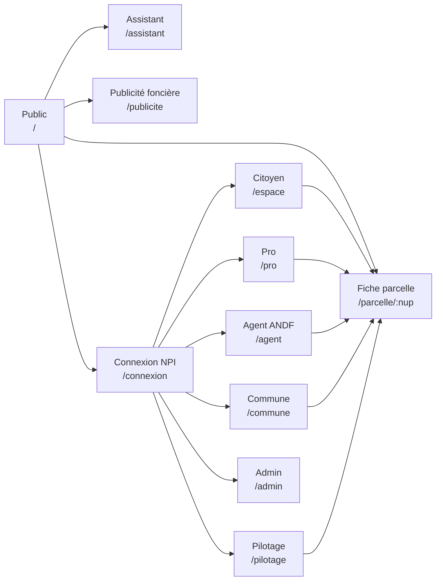

# Sitemap — Foncier Intelligent

> Brief de structure (issu de `/impeccable shape`). Couvre les 18 usages IA et toutes les exigences de `PRD.md`.
> Stack : Next.js App Router + shadcn/ui. Une app, espaces par rôle. Démo ANDF/ASIN d'abord.
> Légende données : 🟢 réel possible dès maintenant · 🟡 réel partiel (source publique, clé API ou scraping) · 🔴 mock (en attendant l'accès ANDF)

---

## 1. Brief

- **Pour qui** : l'acheteur/citoyen arbitre ; les autres rôles (propriétaire, pro, agent, commune, décideur, admin) ont chacun leur espace.
- **Tâche principale** : saisir un NUP → comprendre en 30 s si la parcelle est sûre (statut, terrain, risque, valeur).
- **Modes** : espace public = *Persuade* (accueil) et *Read* (guides) ; tous les espaces connectés = *Operate*.
- **Fil conducteur** : la **fiche parcelle** est l'objet central. Elle existe en 4 profondeurs (publique, propriétaire, pro, agent) sur le même squelette.
- **Démo** : un sélecteur de rôle (mock NPI) permet de passer d'un espace à l'autre sans vraie authentification.
- **Hors périmètre maintenant** : le monde visuel (couleurs, typo) — il sera fixé avant le premier écran construit.

---

## 2. Vue d'ensemble



**Arborescence App Router**

```
app/
├─ (public)/            layout : header public, footer, recherche NUP
├─ (auth)/              layout : minimal
├─ (espaces)/           layout : SidebarProvider + AppSidebar par rôle
│  ├─ espace/           citoyen & propriétaire
│  ├─ pro/              notaire · géomètre · huissier · banque
│  ├─ agent/            ANDF · BCDF
│  ├─ commune/          maire · CoGeF · SVGF
│  ├─ pilotage/         DG ANDF · MEF · DGI · CENTIF
│  └─ admin/
└─ api/                 route handlers (voir § 11)
```

---

## 3. Espace public — `(public)`

| Route | Page | Contenu clé | Réf. PRD | Données |
|---|---|---|---|---|
| `/` | Accueil | Recherche NUP en héros, 3 promesses, parcelle d'exemple, chiffres cadastre, accès assistant | O1 | 🟢 chiffres publics |
| `/recherche` | Recherche multi-critère | NUP, n° TF, adresse, coordonnées UTM/GPS, clic carte → résultats ou redirection | FP-01 | 🟡 géocodage OSM ; 🔴 index parcelles |
| `/parcelle/[nup]` | **Fiche parcelle publique** | En-tête (NUP, commune, superficie, statut, feu de risque) + onglets ci-dessous | FP-01→07 | voir onglets |
| `/parcelle/[nup]` · Aperçu | | Carte du polygone, statut juridique public, publicité en cours, lien `cadastre.andf.bj/nup/…` | FP-02 | 🟡 lien réel ; 🔴 polygone (sauf 5 NUP publiés : centroïde + superficie réels) |
| `/parcelle/[nup]` · Terrain | | Frise d'images 2016→, indicateurs bâti / NDVI / eau, alertes | IA-01 | 🟡 Earth Engine / Sentinel / Open Buildings |
| `/parcelle/[nup]` · Risque | | Feu tricolore, raisons, comment lever chaque doute | IA-14 | 🟢 moteur de règles ; 🔴 entrées registre |
| `/parcelle/[nup]` · Valeur | | Fourchette de prix, comparables, tendance quartier | IA-13 | 🔴 |
| `/parcelle/[nup]` · Climat | | Score inondation / érosion | IA-06 | 🟡 Sentinel-1 |
| `/parcelle/[nup]/rapport` | Rapport de due diligence | Aperçu imprimable, export PDF signé/horodaté | FP-06 | 🟢 génération ; données mixtes |
| `/carte` | Explorateur | Carte plein écran, couches (parcelles, domaine État, forêts classées, zones inondables, publicité en cours), panneau latéral de parcelle | CA-01 | 🟢 fonds OSM ; 🟡 couches ouvertes ; 🔴 parcelles |
| `/assistant` | Assistant foncier | Chat sourcé (articles cités), suggestions de questions, outils : fiche NUP, calcul de frais, suivi | IA-09, AS-01 | 🟢 LLM + RAG sur `hackathon_documents/` et textes de loi |
| `/publicite` | Avis de publicité foncière | Liste + carte des avis en cours, compte à rebours d'opposition, filtre commune | PU-01 | 🟡 scraping du site ANDF ; 🟢 5 avis réels |
| `/publicite/[id]` | Détail d'un avis | Texte original, données extraites, parcelles voisines, « s'abonner », « faire opposition » | PU-01→03, IA-11 | 🟢 extraction LLM |
| `/guides` | Procédures | Cartes : acheter en urbain, en rural, étrangers, titre foncier, mutation, certificat d'appartenance, opposition, plainte | — | 🟢 contenu réel |
| `/guides/[slug]` | Guide | Étapes, pièces, délais, coûts, base légale, CTA vers l'outil/dossier | — | 🟢 |
| `/outils/frais` | Calculateur de frais | Montant → frais de mutation (0,3 % / 30 000 F / 0,5 % + 500 F), autres prestations | TR-04 | 🟢 règles |
| `/outils/estimation` | Estimation rapide | Commune, quartier, loti/non loti, superficie → fourchette | IA-13 | 🔴 |
| `/outils/eligibilite` | Qui peut acheter ? | Questionnaire nationalité / urbain-rural / surface → règles CFD | TR-06 | 🟢 règles |
| `/a-propos` | À propos | Projet, hackathon, principes IA | — | 🟢 |
| `/ia-responsable` | Charte IA | Humain dans la boucle, explicabilité, données | § 14 PRD | 🟢 |
| `/confidentialite` · `/conditions` | Légal | | — | 🟢 |
| `/developpeurs` | API | Docs OpenAPI des endpoints publics | § 10 PRD | 🟢 |

## 4. Authentification — `(auth)`

| Route | Page | Données |
|---|---|---|
| `/connexion` | Connexion NPI (mock) + « Entrer en démo » | 🔴 |
| `/connexion/role` | Choix du rôle de démo (8 personas) | 🔴 |
| `/verification` | OTP (2FA agents/notaires) | 🔴 |

---

## 5. Espace citoyen & propriétaire — `/espace`

| Route | Page | Contenu clé | Réf. | Données |
|---|---|---|---|---|
| `/espace` | Tableau de bord | Mes parcelles, alertes récentes, dossiers en cours, action suivante | — | 🔴 |
| `/espace/parcelles` | Mes parcelles | Liste/carte, état de surveillance | — | 🔴 |
| `/espace/parcelles/[nup]` | Fiche propriétaire | Fiche complète + surveillance, historique privé, documents | FP, IA-01 | 🟡 |
| `/espace/surveillance` | Veille | Parcelles suivies (miennes + voisines + convoitées), canaux SMS/WhatsApp | PU-03 | 🔴 |
| `/espace/alertes` | Alertes | Flux filtrable : satellite, publicité voisine, litige, dossier | IA-01, IA-11 | 🟡 |
| `/espace/alertes/[id]` | Détail d'alerte | Avant/après, explication, actions (opposition, signalement) | IA-02 | 🟡 |
| `/espace/verifications` | Mes vérifications | Rapports de due diligence générés | FP-06 | 🔴 |
| `/espace/verifications/nouvelle` | Vérifier avant d'acheter | NUP + photos des pièces du vendeur → rapport | IA-07, IA-08, IA-14 | 🟢 extraction ; 🔴 registre |
| `/espace/dossiers` | Mes dossiers | Liste, statut, délai estimé | TR-05 | 🔴 |
| `/espace/dossiers/nouveau` | Assistant de dossier | Étapes : type de demande → éligibilité → pièces (photo/upload) → extraction & contrôle IA → récapitulatif → paiement (mock MoMo) → transmission | TR-01→06, IA-07 | 🟢 extraction ; 🔴 transmission |
| `/espace/dossiers/[id]` | Suivi de dossier | Timeline, pièces, demandes de complément, messages | TR-05 | 🔴 |
| `/espace/oppositions/nouvelle` | Faire opposition | Pré-rempli depuis un avis, pièces, modèle de lettre | PU-04 | 🟢 génération |
| `/espace/litiges` | Mes litiges | Liste, statut, médiation | LI-01 | 🔴 |
| `/espace/litiges/nouveau` | Déposer une plainte | Formulaire CGP guidé, classification IA | LI-02, IA-12 | 🟢 classification |
| `/espace/litiges/[id]` | Détail litige | Parties, parcelle, étapes, documents | LI | 🔴 |
| `/espace/marche` | Parcelles recommandées | Parcelles « feu vert » en vente volontaire, filtres budget/zone | IA-16 | 🔴 (V3) |
| `/espace/annonces` | Mes annonces | Mettre en vente une parcelle vérifiée | IA-16 | 🔴 (V3) |
| `/espace/paiements` | Paiements | Reçus, factures | — | 🔴 |
| `/espace/profil` | Profil | NPI, contacts, langue | — | 🔴 |
| `/espace/notifications` | Préférences | SMS, WhatsApp, email, fréquence | — | 🔴 |

## 6. Espace professionnel — `/pro`

Sidebar adaptée au sous-rôle (notaire, géomètre, huissier, banque).

| Route | Page | Rôle | Réf. | Données |
|---|---|---|---|---|
| `/pro` | Tableau de bord | tous | — | 🔴 |
| `/pro/due-diligence` | Vérifications | notaire, banque | FP-06, IA-14 | 🔴 |
| `/pro/due-diligence/nouvelle` | Nouvelle vérification | NUP + pièces → rapport | IA-07, 08, 14 | 🟢 extraction |
| `/pro/due-diligence/[id]` | Rapport | Risque détaillé, anomalies, terrain, pièces annotées | IA-01, 08, 14 | 🟡 |
| `/pro/clients` | Clients & dossiers | notaire | — | 🔴 |
| `/pro/mutations` | Mutations | notaire | TR-03 | 🔴 |
| `/pro/mutations/nouvelle` | Préparer une mutation | Pièces, calcul des frais, contrôle AVM du prix, transmission E-Notaire | TR-03/04, IA-13, FI-02 | 🟢 frais ; 🔴 E-Notaire |
| `/pro/mutations/[id]` | Suivi | notaire | TR-05 | 🔴 |
| `/pro/leves` | Mes levés | géomètre | CA-03 | 🔴 |
| `/pro/leves/nouveau` | Importer un levé | DXF / GeoJSON / CSV de sommets, reprojection UTM 31N | CA-03 | 🟢 parsing |
| `/pro/leves/[id]` | Éditeur | Carte + orthophoto, pré-tracé IA, contrôle topologique (chevauchements voisins), validation | IA-03, IA-17 | 🟢 topologie ; 🔴 ortho |
| `/pro/actes` | État descriptif · compulsion | huissier, notaire | e-services | 🔴 |
| `/pro/actes/nouveau` | Demander un acte | huissier, notaire | e-services | 🔴 |
| `/pro/portefeuille` | Garanties | banque : parcelles hypothéquées, alertes | IA-01, 14 | 🔴 |
| `/pro/portefeuille/[nup]` | Garantie | Valeur, risque, évolution du terrain | IA-13, 14 | 🟡 |
| `/pro/api` | Clés API | banque | § 10 | 🔴 |
| `/pro/facturation` | Facturation | tous | — | 🔴 |

## 7. Espace agent ANDF / BCDF — `/agent`

| Route | Page | Contenu clé | Réf. | Données |
|---|---|---|---|---|
| `/agent` | Ma journée | File priorisée, échéances de publicité, alertes, KPI personnels | IA-18 | 🔴 |
| `/agent/recherche` | Recherche interne | Parcelles, personnes (NPI/IFU), dossiers, TF | — | 🔴 |
| `/agent/parcelles/[nup]` | Fiche parcelle interne | Tout : titulaires, RRR, historique, dossiers, litiges, terrain, audit | FP | 🔴 |
| `/agent/dossiers` | File d'instruction | Data table : type, commune, complétude, score d'anomalie, SLA | TR | 🔴 |
| `/agent/dossiers/[id]` | **Poste d'instruction** | 3 panneaux redimensionnables : pièces (visionneuse + champs extraits) · carte & terrain · copilote (résumé, anomalies, projet d'acte). Barre de décision : valider / complément / rejeter (motif) | IA-07, 08, 10, 14, 17 | 🟢 IA ; 🔴 dossiers |
| `/agent/dossiers/[id]/historique` | Journal du dossier | Actions, suggestions IA acceptées/rejetées | § 14 | 🔴 |
| `/agent/publicite` | Publicité | Avis à préparer, en cours, clos ; projet d'avis généré | IA-10, PU | 🟢 génération |
| `/agent/publicite/[id]` | Avis | Oppositions reçues, synthèse | PU | 🔴 |
| `/agent/oppositions` | Oppositions | Liste, rattachement aux dossiers | PU-04 | 🔴 |
| `/agent/litiges` | Litiges | Tri IA, cas similaires | IA-12 | 🟢 classification |
| `/agent/litiges/[id]` | Litige | Parties, parcelle, orientation (CoGeF, CGP, tribunal) | LI-03 | 🔴 |
| `/agent/alertes` | Empiètements | Carte + liste des détections, priorité | IA-02, DE-01 | 🟡 |
| `/agent/alertes/[id]` | Alerte | Avant/après, confiance, créer mission terrain, clore (faux positif) | IA-02 | 🟡 |
| `/agent/terrain` | Missions terrain | Liste mobile, hors-ligne | CA-04 | 🔴 |
| `/agent/terrain/[id]` | Mission | Itinéraire, checklist, photo géolocalisée, compte rendu | CA-04 | 🔴 |
| `/agent/cadastre/qualite` | Qualité cadastre | Chevauchements, trous, corrections suggérées | IA-17 | 🟢 calcul ; 🔴 données |
| `/agent/cadastre/pre-trace` | Validation pré-tracé | Lots de polygones IA à valider | IA-03 | 🔴 |
| `/agent/documents-suspects` | Documents suspects | Pièces signalées, comparaison spécimens | IA-08 | 🔴 |
| `/agent/rural/preemption` | Préemption | Transactions rurales ≥ 2 ha, délai, avis | DE-03 | 🔴 |
| `/agent/rural/mise-en-valeur` | Mise en valeur | Projets > 20 ha, indicateur constaté/attendu | IA-04, DE-02 | 🟡 NDVI |
| `/agent/rural/mise-en-valeur/[id]` | Projet | Séries NDVI, visites, décision | IA-04 | 🟡 |
| `/agent/rural/origine-fonds` | Origine des fonds | Dossiers > 20 ha, pièces, contrôle | TR-06 | 🔴 |
| `/agent/archives` | Numérisation | Lots de scans de livres fonciers, extraction, validation | IA-07 | 🟢 extraction |

## 8. Espace commune — `/commune`

| Route | Page | Contenu clé | Réf. | Données |
|---|---|---|---|---|
| `/commune` | Tableau de bord | Parcelles, dossiers, litiges, alertes de la commune | — | 🔴 |
| `/commune/carte` | Carte communale | Foyers de litiges, alertes, publicité | LI-04 | 🔴 |
| `/commune/litiges` | Litiges | Liste, orientation | LI | 🔴 |
| `/commune/mediations` | Médiations CoGeF / SVGF | Calendrier, séances, PV générés | IA-12 | 🟢 génération |
| `/commune/mediations/[id]` | Séance | Parties, compte rendu, accord | — | 🔴 |
| `/commune/transactions-rurales` | Accompagnement SVGF | Transactions villageoises en cours | — | 🔴 |
| `/commune/fiscalite` | Assiette TFU | Bâti non déclaré détecté, priorisation | IA-05, FI-01 | 🟡 Open Buildings |
| `/commune/patrimoine` | Patrimoine communal | Parcelles de la commune, surveillance | DE-01 | 🔴 |
| `/commune/rapports` | Rapports | Exports mensuels | — | 🔴 |

## 9. Pilotage — `/pilotage`

| Route | Page | Contenu clé | Réf. | Données |
|---|---|---|---|---|
| `/pilotage` | Vue nationale | KPI PRD § 13 : délais, complétude, alertes, litiges, recettes | § 13 | 🔴 |
| `/pilotage/carte` | Carte nationale | Couverture cadastre, densité d'alertes et de litiges par commune | — | 🟢 limites communales ; 🔴 valeurs |
| `/pilotage/delais` | Délais & charge | Par BCDF, prévisions, goulots | IA-18 | 🔴 |
| `/pilotage/risques` | Risques | Empiètements, litiges, zones climatiques | IA-02, 06 | 🔴 |
| `/pilotage/fiscalite` | Fiscalité | TFU, prix déclarés vs AVM | IA-05, 13 | 🔴 |
| `/pilotage/lcb-ft` | Anti-blanchiment | Cas signalés, graphe personnes–sociétés–parcelles | IA-15 | 🔴 |
| `/pilotage/lcb-ft/[id]` | Cas | Graphe, chronologie, pièces | IA-15 | 🔴 |
| `/pilotage/ia` | Qualité IA | Précision par modèle, taux d'acceptation, dérive, équité par commune/genre | § 14 | 🔴 |
| `/pilotage/rapports` | Rapports | Exports | — | 🔴 |

## 10. Administration — `/admin`

| Route | Page | Données |
|---|---|---|
| `/admin/utilisateurs` | Utilisateurs | 🔴 |
| `/admin/roles` | Rôles & permissions | 🔴 |
| `/admin/communes` | Couverture (12 e-Foncier, 14 Terra Benin) | 🟢 listes réelles |
| `/admin/integrations` | État des sources : e-Foncier, PNS, E-Notaire, MoMo, DGI, Earth Engine, LLM | 🟡 |
| `/admin/connaissances` | Corpus de l'assistant (textes, versions, indexation) | 🟢 |
| `/admin/modeles` | Seuils d'alerte et de risque, versions de modèles | 🔴 |
| `/admin/specimens` | Spécimens cachets/signatures | 🔴 |
| `/admin/bareme` | Barème des frais | 🟢 |
| `/admin/audit` | Journal d'audit | 🔴 |

---

## 11. Transverses

| Élément | Où | shadcn |
|---|---|---|
| Palette de commandes (⌘K) : NUP, pages, actions | partout | `command` + `dialog` |
| Sélecteur de rôle (démo) | header / sidebar | `dropdown-menu`, `avatar` |
| Aperçu rapide de parcelle | clic sur un NUP partout | `sheet` (desktop) · `drawer` (mobile) |
| Assistant contextuel | bouton flottant dans les espaces, contexte = page courante | `sheet` + AI Elements |
| Notifications | header | `popover`, `sonner` |
| Fil d'Ariane | espaces | `breadcrumb` |
| Explication IA (« pourquoi ? ») | tout score/alerte | `hover-card`, `collapsible` |
| États vides / chargement / erreur | partout | `empty`, `skeleton`, `spinner`, `alert` |

**Route handlers (`app/api`)**

| Endpoint | Rôle | Données |
|---|---|---|
| `GET /api/parcels/[nup]` | Fiche (filtrée par rôle) | 🔴 → ANDF |
| `GET /api/parcels/[nup]/imagery` | Indicateurs et vignettes | 🟡 Earth Engine |
| `GET /api/parcels/[nup]/risk` | Score + raisons | 🟢 règles |
| `POST /api/documents/extract` | Extraction de pièce | 🟢 LLM multimodal |
| `POST /api/assistant` | Chat en streaming (AI SDK) | 🟢 |
| `POST /api/fees` | Calcul des frais | 🟢 |
| `GET /api/publicity` · cron de synchro | Avis ANDF | 🟡 |
| `POST /api/subscriptions` | Abonnement aux alertes | 🔴 |

---

## 12. Composants shadcn par type d'écran

| Écran | Composants |
|---|---|
| Layouts d'espace | `sidebar`, `breadcrumb`, `separator`, `scroll-area` |
| Fiche parcelle | `tabs`, `card`, `badge`, `tooltip`, `hover-card`, `aspect-ratio`, `carousel` (frise d'images), `chart` |
| Listes (dossiers, alertes, litiges) | `data-table` (TanStack) + `table`, `pagination`, `dropdown-menu`, `toggle-group`, `badge` |
| Formulaires et assistants de dossier | `field`, `input`, `input-group`, `select`, `combobox`, `radio-group`, `checkbox`, `switch`, `textarea`, `calendar`/`date-picker`, `input-otp`, `progress` (étapes) |
| Poste d'instruction | `resizable`, `tabs`, `scroll-area`, `alert-dialog` (décision), `kbd` |
| Tableaux de bord | `card`, `chart` (Recharts), `item`, `progress` |
| Chat | registre **AI Elements** (bâti sur shadcn) : conversation, message, prompt-input, sources, tool |
| Mobile terrain | `drawer`, `sheet`, `button-group` |

**Hors shadcn (aucun équivalent)** : carte → MapLibre GL (`react-map-gl`) ; graphe LCB-FT → `@xyflow/react` ; visionneuse PDF → `react-pdf` ; export PDF → génération serveur.

---

## 13. Données réelles vs mocks

| 🟢 Réel dès maintenant | 🟡 Réel partiel | 🔴 Mock |
|---|---|---|
| Assistant LLM + RAG sur les textes ANDF · extraction de pièces · calcul des frais · règles d'éligibilité et de risque · contrôles topologiques · guides · 5 avis de publicité et leurs NUP · listes des communes · fonds de carte OSM | Imagerie (Earth Engine : compte requis) · Open Buildings / Dynamic World · publicité ANDF (scraping) · liens `cadastre.andf.bj` · géocodage | Registre (titulaires, RRR, TF) · dossiers · polygones hors avis · litiges · paiements MoMo · E-Notaire · AVM · LCB-FT · KPI nationaux · utilisateurs |

**Règle mock** : une couche `lib/data/*` avec la même interface pour mock et réel, pour brancher les vraies sources sans toucher aux écrans. Jeux mock réalistes : communes et arrondissements réels, NUP au bon format (9 chiffres), coordonnées UTM 31N plausibles, montants cohérents avec les prix 2025.

---

## 14. États à concevoir pour chaque écran clé

- **Fiche parcelle** : NUP introuvable · parcelle hors zone couverte (hors des 12 communes) · imagerie indisponible / nuageuse · statut en litige · parcelle de l'État.
- **Dossier** : pièce illisible · pièce manquante · incohérence détectée · paiement échoué · complément demandé.
- **Assistant** : question hors domaine · réponse sans source (interdite) · renvoi vers notaire/BCDF.
- **Alerte** : faux positif · en vérification · confirmée.
- **Global** : chargement, vide, erreur réseau, hors-ligne (mobile terrain).

---

## 15. Ordre de construction proposé

1. Fondations : layouts `(public)` et `(espaces)`, sélecteur de rôle, ⌘K, couche `lib/data` avec mocks.
2. **Fiche parcelle** (4 profondeurs) + `/carte` : le cœur, visible par tous.
3. `/assistant` (réel) + `/outils/*` + `/guides` (réels).
4. `/publicite` (réel partiel) + surveillance citoyenne.
5. Assistant de dossier citoyen + extraction de pièces (réel).
6. Poste d'instruction agent + copilote.
7. Alertes d'empiètement + missions terrain.
8. Espace pro, commune, pilotage, admin.

## 16. Décisions ouvertes

1. Monde visuel (à fixer avant l'étape 1).
2. Fournisseur LLM pour l'assistant et l'extraction.
3. Compte Google Earth Engine disponible ou non pour la démo.
4. Scraping de la publicité ANDF autorisé ou copie manuelle des avis.
